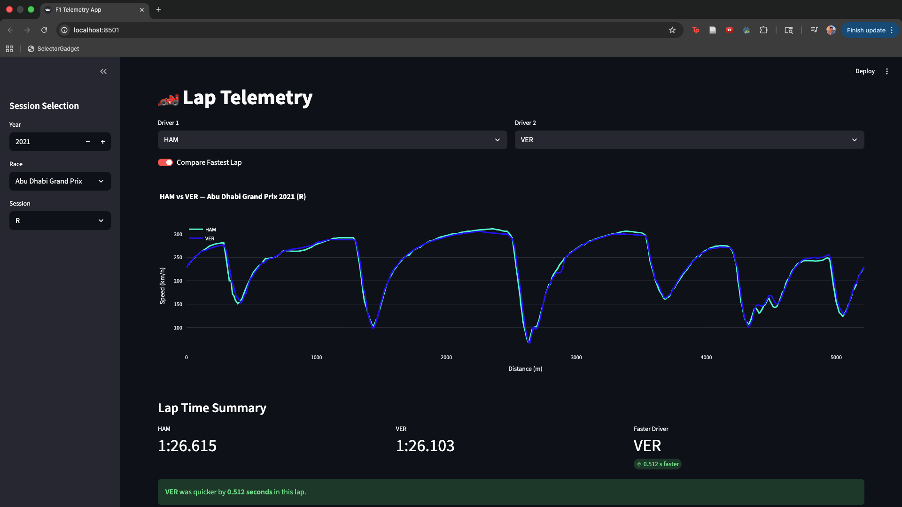

# F1 Lap Telemetry Dashboard

An interactive Streamlit app for exploring and visualizing Formula 1 lap telemetry data.
Compare two drivers’ speed traces, lap times, and performance metrics for any race session using data powered by the [`fastf1`](https://docs.fastf1.dev/) API.

## Features

* Session selection – choose year, race, and session type (FP, Qualifying, or Race)
* Driver comparison – overlay telemetry for two drivers side-by-side
* Dynamic visualizations – interactive speed-vs-distance charts powered by Plotly
* Performance summary – automatic calculation of lap time deltas and fastest driver

## App Preview



## Run Locally

```
# Clone repo
git clone https://github.com/yanjwani/telemetry_viz_app.git
cd telemetry_viz_app

# Install dependencies
pip install -r requirements.txt

# Launch Streamlit app
streamlit run app.py
```

